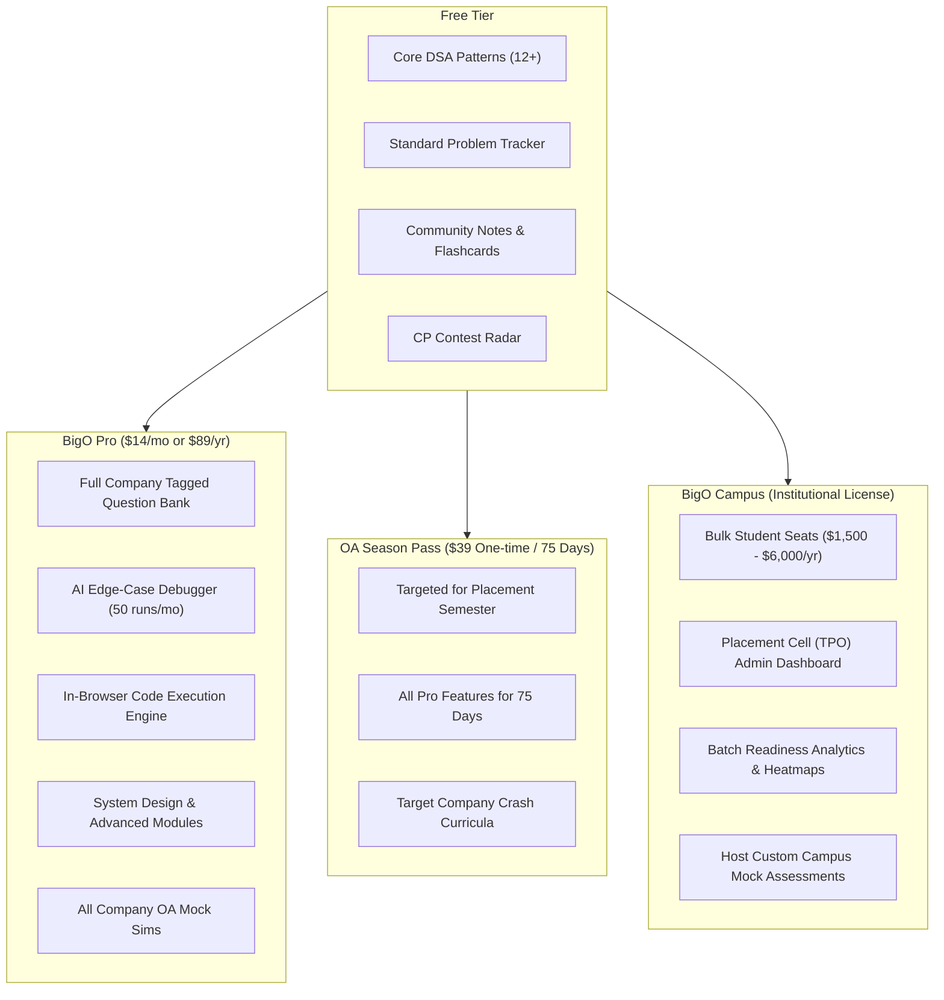
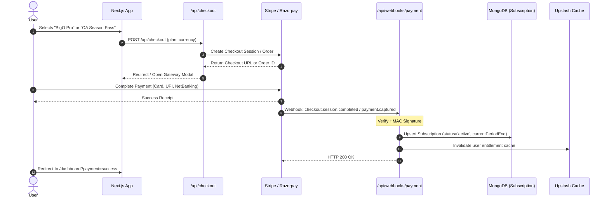
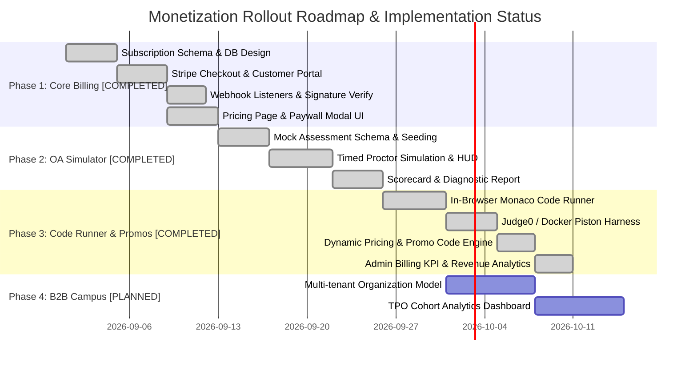

# BigO — Monetization Strategy & Feature Specification

> **Document Status:** Implemented Architecture & Production Operations (Phases 1–3 Live)  
> **Author:** Senior Technical Lead / Engineering  
> **Target Audience:** Engineering, Product, Stakeholders  

---

## 1. Executive Summary & Market Mechanics

Engineering candidates and college students preparing for technical placements operate under extreme time pressure and high emotional stakes. A successful placement changes an engineer's lifetime earnings trajectory ($20k–$150k+ initial salary). 

However, tech candidates will **not** pay for:
- Basic problem lists or progress checkboxes (readily available on LeetCode / NeetCode / Striver for free).
- Static notes that can be found in free documentation or YouTube videos.

Tech candidates **will readily pay** for:
1. **Eliminating test-day surprises** (real-world simulation of company OAs with exact timers, platform interfaces, and hidden testcases).
2. **Instant feedback loops on failing code** (discovering why code passed 11/15 testcases with TLE/WA without spending 3 hours stuck).
3. **Recent, high-probability test questions** (questions asked by target companies in campus/off-campus drives in the last 30–60 days).
4. **Placement readiness guarantees** (custom crash roadmaps based on weakness diagnosis).

This document outlines the **Freemium + OA Season Pass + B2B Campus** monetization architecture for BigO.

---

## 2. Product Tier Structure & Entitlement Matrix



### Entitlement Comparison Table

| Feature / Capability | Free Tier | BigO Pro (Subscription) | OA Season Pass (One-off) | BigO Campus (B2B) |
|---|:---:|:---:|:---:|:---:|
| **DSA Patterns & Core CS Notes** | ✅ Full Access | ✅ Full Access | ✅ Full Access | ✅ Full Access |
| **Personal Heatmap & Progress** | ✅ Standard | ✅ Advanced Analytics | ✅ Advanced Analytics | ✅ Advanced + TPO Synced |
| **Curated Recent OA Questions (Last 60 Days)** | 🔒 Locked (Preview 2) | ✅ Full Library | ✅ Full Library | ✅ Full Library |
| **Company-Specific Mock OA Simulator** | 🔒 1 Free Demo Test | ✅ Unlimited | ✅ Unlimited | ✅ Unlimited + Custom Tests |
| **AI Edge-Case & Failing Input Generator** | 3 queries / day | 100 queries / mo | 250 queries / pass | Custom Campus Quota |
| **In-Browser Code Execution Sandbox** | 🔒 External Link only | ✅ Unlimited Executions | ✅ Unlimited Executions | ✅ Unlimited Executions |
| **Advanced System Design & DevOps** | 🔒 Summary only | ✅ Full Deep Dives | ✅ Full Deep Dives | ✅ Full Deep Dives |
| **TPO / Cohort Performance Dashboard** | ❌ None | ❌ None | ❌ None | ✅ Institutional Dashboard |

---

## 3. Core Monetization Feature Specifications

### 3.1 Feature: Real-World Timed OA Simulator

The #1 reason candidates fail Online Assessments (HackerRank, CodeSignal, Mercer Mettl, Glider) is **test environment anxiety** and **harsh time constraints**.

#### Key Capabilities:
- **Platform Emulation Modes**: Toggle interface layouts to emulate HackerRank, CodeSignal, and LeetCode contest UIs.
- **Strict Proctoring Emulation**:
  - Fullscreen lock toggle with exit warnings.
  - Tab-switching detection counter (simulates strict corporate OAs).
  - Copy-paste blocking and timed section cut-offs.
- **Company Packs**: Pre-configured tests matching current hiring patterns:
  - *Amazon SDE-1*: 2 Problems (Medium-Hard) + 15 min Leadership Principles questionnaire (90 mins).
  - *Uber / Atlassian*: 3 Problems with high-volume testcases and strict memory limits (75 mins).
  - *Fintech / HFT (Tower, DE Shaw, Optiver)*: 2 Fast Algorithmic + 1 Concurrency/SQL (60 mins).
- **Post-Assessment Performance Diagnostic**:
  - Percentile score vs. other BigO candidates.
  - Time spent per problem breakdown.
  - Space/time complexity estimation and hidden edge cases missed.

---

### 3.2 Feature: "Why Did My Code Fail?" AI Edge-Case Debugger

When students get `11/15 testcases passed` in a test run, standard platforms hide the testcases. Candidates waste hours guessing or looking at editorial spoilers.

#### Workflow:
1. Candidate pastes their failing code and selects the problem.
2. The AI Engine analyzes the AST and algorithmic constraints using a structured LLM prompt.
3. Instead of giving the full solution, it returns:
   - **The exact minimal failing input** (e.g., `nums = [0, 0, -1]`, `k = 0`).
   - **The failure category**: Off-by-one boundary, 32-bit integer overflow, recursion depth limit, or non-optimal $O(N^2)$ inner loop causing TLE.
   - **A Socratic guiding hint** to fix the issue independently.
4. **Token Control**: Metered via Redis token bucket and stored in `AiCreditLog`.

---

### 3.3 Feature: Fresh 30–60 Day Company OA Question Bank

Placement drives run in seasonal waves (July–November for campus placements; Jan–April for off-campus/internships).

#### Architecture:
- A new section under `/oa` or `/company`:
  - Filter by Company, Role (Intern / New Grad / SDE-1), and Date Verified.
  - Problem difficulty distribution and most recurring pattern variations (e.g., "70% of recent Google India OAs tested Graph Dijkstra + Bitmask DP").
  - Premium paywall lock on questions less than 90 days old.

---

### 3.4 Feature: Native In-Browser Code Runner (Judge0 / Piston)

Allowing candidates to compile and execute their code directly inside BigO without switching to external sites dramatically increases session retention and perceived platform value.

#### Architecture:
- Code Editor: `@monaco-editor/react` with Vim/Sublime keybindings and theme synchronization.
- Backend Execution Engine:
  - Self-hosted **Judge0 CE** (or managed API) or **Piston**.
  - Multi-language support: C++20, Java 21, Python 3.12, TypeScript/JavaScript.
  - Resource isolation: Dockerized container execution with 2s CPU timeout and 256MB RAM constraints.

---

### 3.5 Feature: B2B Campus Placement Cell (TPO) Dashboard

Selling institutional licenses to engineering colleges and coding academies provides predictable, lump-sum annual revenue ($1,500 – $6,000 per college per year).

#### Capabilities:
- **Multi-Tenant College Organization Model**: Unique college subdomain or invite portal (e.g., `bigoprep.tech/campus/mit`).
- **Batch Leaderboard & Readiness Score**: TPOs can see which students are placement-ready (80%+ pattern mastery) and which need remedial training.
- **Custom Internal Contests**: TPOs can curate tests from BigO's problem bank and conduct college-wide mock selection rounds with automated scoring.

---

## 4. Technical Architecture & Database Schema Additions

### 4.1 Schema Extensions

#### 1. `Subscription` Collection (`models/subscription.ts`)
```typescript
import { Schema, model, models, Types } from 'mongoose';

export type PlanType = 'free' | 'pro_monthly' | 'pro_annual' | 'oa_pass' | 'campus';
export type SubscriptionStatus = 'active' | 'canceled' | 'past_due' | 'expired' | 'trialing';

const subscriptionSchema = new Schema(
  {
    userId: { type: Schema.Types.ObjectId, ref: 'User', required: true, index: true },
    organizationId: { type: Schema.Types.ObjectId, ref: 'Organization' }, // Optional B2B link
    plan: {
      type: String,
      enum: ['free', 'pro_monthly', 'pro_annual', 'oa_pass', 'campus'],
      default: 'free',
      required: true,
    },
    status: {
      type: String,
      enum: ['active', 'canceled', 'past_due', 'expired', 'trialing'],
      default: 'active',
      required: true,
    },
    provider: { type: String, enum: ['stripe', 'razorpay', 'lemonsqueezy', 'manual'], required: true },
    customerId: { type: String, required: true },
    subscriptionId: { type: String }, // Gateway subscription reference ID
    orderId: { type: String },        // For one-time payments (OA Pass)
    currentPeriodStart: { type: Date, default: Date.now },
    currentPeriodEnd: { type: Date, required: true },
    cancelAtPeriodEnd: { type: Boolean, default: false },
    aiCreditsQuota: { type: Number, default: 10 },
    aiCreditsUsed: { type: Number, default: 0 },
  },
  { timestamps: true }
);

subscriptionSchema.index({ userId: 1, status: 1 });
export const Subscription = models.Subscription || model('Subscription', subscriptionSchema);
```

#### 2. `MockAssessment` Collection (`models/mockAssessment.ts`)
```typescript
const mockAssessmentSchema = new Schema(
  {
    title: { type: String, required: true },
    slug: { type: String, required: true, unique: true },
    company: { type: String, required: true, index: true },
    difficulty: { type: String, enum: ['Easy', 'Medium', 'Hard'], required: true },
    durationMinutes: { type: Number, required: true, default: 90 },
    problemIds: [{ type: Schema.Types.ObjectId, ref: 'Problem' }],
    instructions: { type: String, default: '' },
    isProOnly: { type: Boolean, default: true },
    active: { type: Boolean, default: true },
  },
  { timestamps: true }
);
```

#### 3. `AssessmentSubmission` Collection (`models/assessmentSubmission.ts`)
```typescript
const assessmentSubmissionSchema = new Schema(
  {
    userId: { type: Schema.Types.ObjectId, ref: 'User', required: true, index: true },
    assessmentId: { type: Schema.Types.ObjectId, ref: 'MockAssessment', required: true },
    startTime: { type: Date, required: true },
    endTime: { type: Date },
    tabSwitchCount: { type: Number, default: 0 },
    score: { type: Number, default: 0 },
    maxScore: { type: Number, default: 100 },
    results: [
      {
        problemId: { type: Schema.Types.ObjectId, ref: 'Problem' },
        code: { type: String },
        language: { type: String },
        passedCases: { type: Number },
        totalCases: { type: Number },
        timeTakenSeconds: { type: Number },
      },
    ],
    status: { type: String, enum: ['in_progress', 'completed', 'timed_out', 'abandoned'], default: 'in_progress' },
  },
  { timestamps: true }
);
```

---

### 4.2 Payment Gateway Architecture



#### Multi-Gateway Strategy:
- **International Users (USD / EUR / GBP)**: Stripe or Lemon Squeezy (acts as Merchant of Record handling sales tax / VAT compliance).
- **Indian Market (INR)**: Razorpay or Cashfree (critical for UPI, domestic debit cards, and net banking support where global credit card checkout conversion drops by >60%).

---

### 4.3 Entitlement Guard Layer

Create a reusable entitlement verification helper to wrap API routes and Server Actions:

```typescript
// lib/entitlements.ts
import { Subscription } from '@/models/subscription';
import { ApiError } from '@/lib/errors';

export async function checkUserEntitlement(userId: string) {
  const sub = await Subscription.findOne({
    userId,
    status: 'active',
    currentPeriodEnd: { $gt: new Date() },
  }).lean();

  const isPro = Boolean(sub && ['pro_monthly', 'pro_annual', 'oa_pass', 'campus'].includes(sub.plan));
  return { isPro, plan: sub?.plan || 'free', creditsRemaining: (sub?.aiCreditsQuota || 10) - (sub?.aiCreditsUsed || 0) };
}

export async function requirePro(userId: string) {
  const entitlement = await checkUserEntitlement(userId);
  if (!entitlement.isPro) {
    throw new ApiError(403, 'UPGRADE_REQUIRED: This feature is only available on BigO Pro.');
  }
  return entitlement;
}
```

---

## 5. Phase-Wise Implementation Roadmap



### Phase 1: Billing Foundation & Entitlement Layer (Completed)
- Integrated `Subscription` collection with user-level unique indexing.
- Implemented Stripe Checkout Sessions and cryptographically verified webhook handlers (`/api/webhooks/stripe`) with customer portal redirection.
- Built clean responsive `/pricing` page with dynamic pricing plan fetching.
- Built entitlement access checks (`withAuth` and subscription plan guards).
- Added zero-friction mock upgrade simulator (`/api/checkout/mock-confirm`) for local offline testing.

### Phase 2: Company OA Simulator & Proctoring (Completed)
- Timed assessment runner engine with countdown timers, fullscreen lockdown, tab-switch monitoring, and copy-paste interception.
- Seeded verified top company OA problem sets (`scripts/seed-assessments.ts`) for Google, Amazon, Uber, Microsoft, etc.
- Post-assessment diagnostic scorecards with percentile curves and pattern mastery verdicts (`/oa/[slug]/report/[submissionId]`).
- Client-side dual-engine neural proctoring with TensorFlow.js (BlazeFace + COCO-SSD) and Groq Llama-3.3 forensic evaluation reports.

### Phase 3: Code Execution Runner, Dynamic Pricing & Promos (Completed)
- Embedded Monaco code editor with multi-language starter templates (C++, Python, Java).
- Deployed isolated code runner infrastructure with local Docker Piston container (`docker-compose.runner.yml`), cloud Judge0, and heuristic fallback.
- Added competitive programming testcase parser (`lib/cp/testcaseParser.ts`) supporting LeetCode-style argument assignments.
- Built dynamic pricing plan database collection (`pricing_plans`) allowing administrators to update pricing, badges, and features without redeployment.
- Built promotional code validation engine (`promo_codes`, `POST /api/promo/validate`) supporting percentage and fixed discounts, expiration dates, and plan restrictions.
- Built administrative billing dashboard (`/admin/billing`) featuring MRR, ARR, active subscriber breakdowns, 6-month historical revenue charts (`RevenueTrendChart.tsx`), and manual plan grant/revocation.

### Phase 4: B2B Campus & Institutional Licensing (Next Milestone)
- Multi-tenant university support with branded onboarding URLs.
- Admin portal for Training & Placement Officers (TPO) to view student batch readiness heatmaps.
- Capability for colleges to run customized campus-wide mock placement assessments on BigO infrastructure.

---

## 6. Unit Economics & Infrastructure Cost Estimation

| Component | Cost Structure | Mitigation Strategy |
|---|---|---|
| **LLM Forensic Activity Reports** | ~$0.003 – $0.008 per submission (Groq Llama-3.3-70B) | High-speed Groq inference API; deterministic fallback evaluator when offline. Strict credit allowances per tier. |
| **Code Execution (Piston/Judge0)** | Self-hosted Docker container ($5–$15/mo VPS) or Pay-as-you-go Judge0 | Sliding-window rate limiting (12 runs/min per user); smart regex/heuristic fallback for standard syntax checks. |
| **Payment Gateway Fees** | 2.9% + $0.30 (Stripe) | Passed as standard cost of doing business. Annual plans and 75-day passes maximize lifetime margin. |
| **Object Evidence Storage (R2)** | $0.015/GB/month + zero egress fees (Cloudflare R2) | WebP compression ($<25\text{ KB}$ per infraction snapshot); 60-day auto-purge TTL. |
| **Gross Margin Target** | **88% – 94%** | Highly optimized serverless and edge compute footprint. |

---

## 7. Operational Status

Phases 1, 2, and 3 are fully operational in production. Next strategic focus is campus placement cell outreach (Phase 4).
